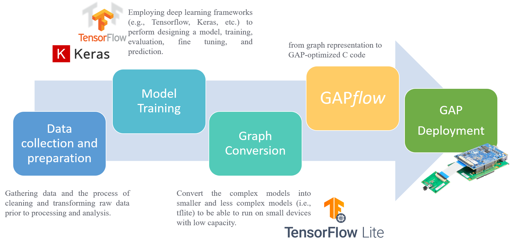

# Developing a Custom Visual Object Spotting system with the GAP *flow*


Deep Learning (DL) frameworks (e.g. TensorFlow) provide a fast way to develop robust image classifiers. 
The desing process leverages the collected data to train personalized detection pipelines, 
which can be embedded into portable low-power devices, such as GAP8.
In this context, the GAP *flow* is the missing piece between high-level DL frameworks and the processing engine GAP8.

To showcase the customization and embedding of a deep learning pipeline for visual object spotting into a GAP8-based smart sensor,
this project demonstrates the design steps in the figure below in case of image vehicle spotting. 
Nevertheless, you can follow the same steps to easily and fastly build your own smart camera system!




# Getting Started with Vehicles Spotting on a GAP8 camera system
The repository includes a trained TF model for image vehicle spotting. 
To covert the model into C code with the GAP *flow* and run the application-code on a [GAP8-based camera system](https://greenwaves-technologies.com/store/): 
```
make clean all run [RGB=1 or 0]
```
The applications works either with greyscale (default, Himax HM01B0) or RGB camera sensors (GalaxyCore GC0308); 
TF models are trained accrodingly on greyscale or RGB augumented data.

The application code runs also on the GAP8 software simulator [GVSOC](https://greenwaves-technologies.com/gvsoc-the-full-system-simulator-for-profiling-gap-applications/):
```
make clean all run platform=gvsoc [RGB=1 or 0]
```
where the visual pipeline is fed with a sample image loaded through JTAG (_images/COCO_val2014_000000000641.ppm_).


In the following, we detail the design steps to train and deploy a custom visual spotting model for vehicle detectecion.

## Requirements
> Tensorflow 1.13
>
> GapSDK 3.5+

## Table of contents:
  - [Dataset Preparation and DL Model training](#dataset-preparing-and-training)
  - [Deep Model Deployment on GAP8 with the GAP *flow*](#nn-on-platform-with-gapflow)
  - [Accuracy Validation with Platform Emulator](#validation-with-platform-emulator)
  
## Dataset Preparing and training

To generate the training and validation dataset and to train the Neural Network model we used the open source [Image Classification](https://github.com/tensorflow/models/tree/master/research/slim) template released by the tensorflow team in its TF1.x version with the usage of slim.
The original code can train a Neural Network model able to signal the presence of persons in the input images. After few, very simple code changes we have extended this feature to one (or more) [object in the COCO dataset](https://github.com/amikelive/coco-labels/blob/master/coco-labels-2014_2017.txt). With this tutorial, we will guide you through the usage of the modified framework to reproduce our results for vehicles signaling.

### Download COCO and distill visualwakewords

Visualwakewords dataset derives from a distilling process applied to COCO. For each image in the source dataset, the present/not-present label is saved in a separated annotation file wether in the original COCO-annotation for that image is present or not the class of interest, in our case it consist in a list of objects ('bicycle', 'car', 'motorcycle', 'airplane', 'bus', 'train', 'truck', 'boat').
The TF framework provides a script to automatically download (if not already done) and convert the COCO dataset into the visualwakewords on desired class or classes. It produces a dataset in the TF-Record format:
```
python3 slim/download_and_convert.py --dataset_name=visualwakewords  \
                                     --dataset_dir=visualwakewords_vehicle  \
                                     --foreground_class_of_interest='bicycle, car, motorcycle, ...'  \
                                     --small_object_area_threshold=0.05  \
                                     --download  \
                                     --coco_dir=coco  \
```
- _dataset_name_: name of the dataset to download (one of "flowers", "cifar10", "mnist", "visualwakewords")
- _dataset\_dir_: where to store the dataset
in case of "visualwakewords":
- _foreground\_class\_of\_interest_: list of COCO object which you want to detect in images
- _small\_object\_area\_threshold_: minimum percentage of area of the interested object to promote the image to the visualwakewords label of true
- _download_: whether to download the entire coco dataset or not if already downloaded
- _coco\_dir_: if download=False where to store the coco dataset, if download=True where it is stored

### Model Training

Now that the dataset is ready we can train a Neural Network on it. For these experiments we used a mobilenet_v2 (with 224x224 input dimensions and width multiplier of 1), the slim/nets folder contains several example model which can be used as well.
```
python3 train_image_classifier.py \
	      --train_dir='vww_vehicle_train_grayscale' \
	      --dataset_name='visualwakewords' \
	      --dataset_split_name=train \
	      --dataset_dir='./visualwakewords_vehicle/' \
	      --log_every_n_steps=100 \
	      --model_name='mobilenet_v2' \
	      --checkpoint_path='./vww_vehicle_train_grayscale/' \
	      --max_number_of_steps=100000   \  
	      --num_clones=1   \
        --quantize_delay=90000  \
	      --use_grayscale
```
- _train\_dir_: where to store checkpoints and training info
- _dataset\_name_: again the name of the dataset to train with
- _dataset\_split_: which dataset partition to use for training
- _dataset\_dir_: where to find the datasets TF-Records
- _model\_name_: name of the netowork architecture to train (_slim/nets/nets\_factory.py_ for a complete list of supported networks)
- _checkpoint\_path_: where to find the checkpoint files to start from, if not given the network will be trained from scratch
- _max\_number\_of\_steps_: number of training steps
- _num\_clones_: number of GPU to use for training
- _quantize\_delay_: after how many steps the model is quantized

NOTE: since the target device leverages on int8 symmetrically quantized operators, the quantization step of tensorflow contrib has been substituted with its experimental version (_contrib\_quantize.experimental\_create\_training\_graph\_(symmetric=True)_). (To avoid this and use the default TF1.x quantization scheme is sufficient to specify _--quantize\_sym=False_)

### Floating Point Model evaluation

The model can now be evaluated in its floating point version on the validation dataset:
```
python3 eval_image_classifier.py   \   
	      --checkpoint_path='vww_train_vehicle_grayscale/'   \   
	      --eval_dir='vww_eval_vehicle_grayscale/' \  
      	--dataset_split_name=val   \   
	      --dataset_dir='visualwakewords_vehicle/'  \  
      	--dataset_name='visualwakewords' \  
	      --model_name='mobilenet_v2' \
        --quantize  \ #if the model has been trained with quantization
	      --use_grayscale
```
The script will evaluate the network accuracy as number of well predicted images divided by the total number of images, the number of false positives and false negatives. All these metrics can be inspected through tensorboard:
```
tensorboard --logdir='vww_eval_vehicle_grayscale'
```

### Train & evaluation loop

To inspect the model behaviour during training, i.e. the validation vs training loss, we release a bash script which evaluates the model validation accuracy after every epoch. Example of usage:
```
./train_eval_loop.sh -m ${MODEL_NAME} -b ${BATCH_SIZE} -e ${NUM_EPOCHS} -l ${LEARNING_RATE} -q ${QUANT_DELAY} -i ${IMAGE_SIZE} -g [to use grayscale] 
```
NOTE: in the script are coded the dataset name and directory. Change them accordingly to your project.

### Model export and freeze

To export the inference graph, i.e. the tensorflow graphdef file for the inference:
```
python3 slim/export_inference_graph.py
        --model_name=mobilenet_v2 \
        --image_size=224 \
        --output_file=./mobilenet_v2_224_grayscale.pb  \
        --quantize  \
        --use_grayscale
```

If you then want to use the resulting model with your own or pretrained checkpoints as part of a mobile model, you can run the tensorflow built in command _freeze\_graph_ to get a graph def with the variables inlined as constants using:
```
freeze_graph \
  --input_graph=./mobilenet_v2_224_grayscale.pb \
  --output_graph=./frozen_mbv2_224_grayscale.pb \
  --input_checkpoint=./vww_train_vehicle_grayscale/model.ckpt-100000 \
  --input_binary=true \
  --output_node_names=MobilenetV2/Predictions/Reshape_1
```

To inspect the graph and get the output_node_names you can use [Netron](https://lutzroeder.github.io/netron/)

## NN on platform with GAPFlow

Now we are ready for the effective deployment on GAP platform. To address this, we will show you the usage of the GAPFlow, a toolchain developed by Greenwaves-technologies for Neural Network porting on their devices. You can find the installation guide [here](https://github.com/GreenWaves-Technologies/gap_sdk).
First of all, we will use the __nntool__ for translating the high level model description into an internal description which will be used by the __Autotiler__. This tool will leverage on the predictable memory access pattern of convolutional neural network to optimize the C-code which runs on the platform.
To do this we need a tflite model description:
```
tflite_converter --graph_def=./frozen_mbv2_224_grayscale.pb  \
                 --output_file=mbv2_grayscale.tflite  \
                 --input_arrays=input  \
                 --output_arrays=MobilenetV2/Predictions/Reshape_1  \
                 # if the model has been trained with quantization (suggested)
                 --inference_type=QUANTIZED_UINT8   \
                 --std_dev_val=128  \
                 --mean_val=128
```

### nntool
This tool, beside generate the code needed by the __Autotiler__ to optimize the memory accesses, allows the user to inspect the model before porting and evaluate its accuracy on the platform thanks to specific internal computational kernels which emulate the platform behaviour.
We can open the generated tflite with nntool:
```
nntool mbv2_grayscale.tflite [-q to load also the quantization information]
show
```
_show_ will display the list of layers and the network topology. Don't worry if the model was quantized with TF asymmetric scheme, nntool will translate automatically to GAP scheme at import time.

The model can be now modified to match the __Autotiler__ execution model:
```
adjust
fusions --scale8
```
This two commands tranlsate the graph tensors from a HxWxC order (TF) to CxHxW (Autotiler). Moreover, fusions spots all the substructures in the graph which the Autotiler can handle with a single optimized layer (e.g. Conv+Pool+Relu into one single layer).

__Only if the model was not quantized:__
```
aquant -f 8 -s calibatrion_images/*
```
The model is executed on several images and calibrates the activation quantization ranges beside the constant values ranges for weights and biases (post-training quantization).

The nntool can also validate the accuracy of the model over a validation dataset of images:
```
validation dataset/* [-q to run with quantized kernels]
```
there are several option for this command (see _--help_ for more information), the default behaviour will check the last character of the filename to read the label (e.g. COCO_0000000_1.png means that the true value of the prediction is 1).

If the results are poor you can inspect the quantization and see if the error introduced by it is too large and is the cause of the accuracy drop:
```
qerror image.png
```
will execute the model in both float and quantized version and compare the two results computing the QSNR (quantization signal-to-noise-ratio) for each layer.

NOTE: every time the execution is run in nntool the input must be preprocessed accordingly to what is done in the training process. For example, in our case the model expects a [-1:1] input, to do so we need to set an input function in nntool which translate the [0:255] input to what we need:
```
set input_norm_func 'x: x/128-1'
```

Before saving the nntool graph and generate the C code, we insert in the graph also the Autotiler layer for the image preprocessing:
```
imageformat input_1 bw8 offset_int8
```
This inserts in the graph the parallel and with optimal memory movements of the input preprocessing function described above.

At the end you can save the nntool state and reuse it afterwards:
```
save_state
```
This will save the adjusted+fused+quantized nntool graph in a .json file beside all its parameters .nnparam. At this point you can generate the Autotiler Model code from the nntool saved state and the constants tensors files for weights and biases:
```
nntool -g model.json -m ATModel.c -T path/to/tensors/folder
```

These steps are automatized in the common/model_rules.mk beside the Autotiler model compilation and code generation. The Autotiler will generate 3 functions which you will need to use in your application code:
- __Graph Constructor__: when it is called allocates all the tensors needed by the graph in memory
- __Graph Run__: run the series of layers with optimal memory movements
- __Graph Destructor__: deallocate all the structures allocated by the Constructor

### Run the code on GAP

What is left is to run the effective network on the platform. Don't worry if you do not have one, Greenwaves provides a platform simulator [gvsoc](https://greenwaves-technologies.com/manuals/BUILD/GVSOC/html/index.html) which allows you to try the GAP features without the device itself. 
You can see an example of application code in _main.c_. Apart from the initialization of all the peripherals (LCD, CAMERA, etc.) and tensors allocation, the main part here is the following:
```
/*-------------------OPEN THE CLUSTER-------------------------------*/
  struct pi_device cluster_dev;
  struct pi_cluster_conf conf;
  pi_cluster_conf_init(&conf);
  pi_open_from_conf(&cluster_dev, (void *)&conf);
  pi_cluster_open(&cluster_dev);

/*--------------------------TASK SETUP------------------------------*/
  struct pi_cluster_task *task = pmsis_l2_malloc(sizeof(struct pi_cluster_task));
  if(task==NULL) {
    printf("pi_cluster_task alloc Error!\n");
    pmsis_exit(-1);
  }
  printf("Stack size is %d and %d\n",STACK_SIZE,SLAVE_STACK_SIZE );
  memset(task, 0, sizeof(struct pi_cluster_task));
  task->entry = &RunNetwork;
  task->stack_size = STACK_SIZE;
  task->slave_stack_size = SLAVE_STACK_SIZE;
  task->arg = NULL;
```
The code above configures the 8-core cluster available in the GAP8 Microcontrollers family. Moreover it sets up the task to be executed in parallel (_RunNetwork_ which implements the graph execution defined in ) besides the STACK sizes. Only after this set up the graph can be constructed and run (_\_\_PREFIX(CNN)_ is defined in _mobv2\_vwwvehicle\_quant\_asym.h_ and it matches the name of the function generated by the Autotiler).
```
static void RunNetwork()
{
  printf("Running on cluster\n");
#ifdef PERF
  printf("Start timer\n");
  gap_cl_starttimer();
  gap_cl_resethwtimer();
#endif
  __PREFIX(CNN)(imgin_unsigned, ResOut);
}
```

## Accuracy validation in _\_\_EMUL\_\__ mode

Autotiler provides another, very useful, run mode, the _\_\_EMUL\_\__. With this flag enabled the Autotiler replaces all its GAP parallel code and built-in funcitons with x86 operations which can be executed by normal PC. This allows you to test the results of your deployed network with the same code generated for the platform, but with a much faster execution compared to the gvsoc or platform one. _main\_emul.c_ and _emul.mk_ present the usage of this feature. _main\_emul.c_ gets a folder path and iterates over the files (images) present into it. For each of them the Autotiler network is run and the result is checked versus the ground truth label which is written in the last character of the filename. At the end, a full report of accuracy, false positives and false negatives is reported.

```
make -f emul.mk clean all TEST_ACC=1 RGB=0 or 1
```
To generate the executable.
```
./mobv2_vwwvehicle_quant_asym_emul /path/to/dataset/
```
To run the validation.
NOTE: the code to read images from filesystem is the same as the application specific one which supports only non-compressed __.ppm__ images format.
